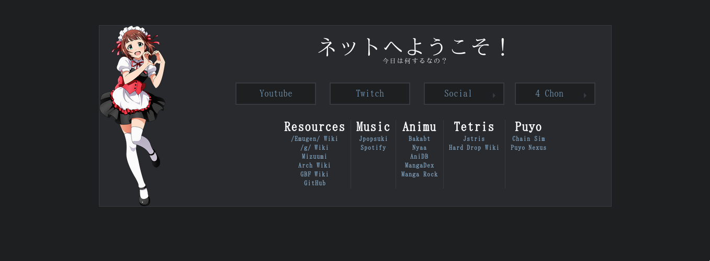

Meido Homepage
====



**Live Demo: [Dark](http://gokoururi.github.io/homepage/)**

From the original readme:

> This repository contains a custom homepage made using html, css and javascript (jQuery). Feel free to download and modify. Comments and suggestions appreciated. Please don't expect too much.

Features:
* Flashy links
* OG Im@s in maid outfits as mascots
* Column style links.
* No sliders for search bars
* I only kept the dark theme code


Customizing, adding mascots and themes
----

To customize mascots, modify the array in [files/mascots.js](files/mascots.js):
```javascript
var mascotList = [ "meido1.png",  "meido2.png", "meido3.png", "meido4.png", "meido5.png", "meido6.png"];
```

To make new theme, you can copy an existing one, and change images and [colors.css](files/colors.css) as you like.  
Please note that entries in your theme's [mascots.js](files/mascots.js) should match with contents of [mascots/](files/images/mascots/) directory.
